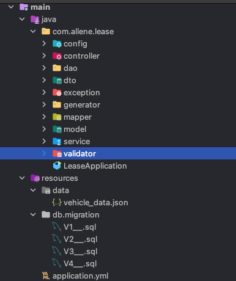

# Allene Vehicle Lease Application
Below are the steps to run the application: 

1. Run MYSQL Docker image

   ```bash
   $ docker run -e MYSQL_ROOT_PASSWORD=root -p 3306:3306 --name mysql -d mysql
   ```

2. Build the project using Gradle:

   ```bash
   $ ./gradlew clean build
   ```

3. Run the project:

   ```bash
   $ ./gradlew bootRun
   ```

4. Import the Postman collection after copying it from the `postman` folder in `Postman`. 

5. Send requests using the Postman collection.(for reference please check screenshot.docx located in postman folder) 
   Verify the results.

6. Package Structure:
 
     